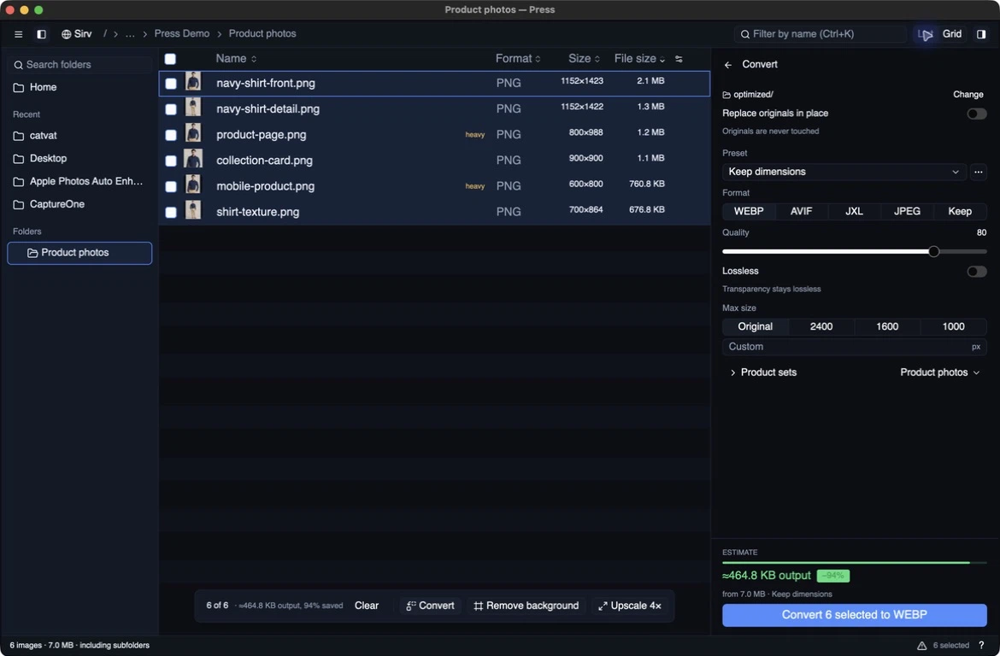
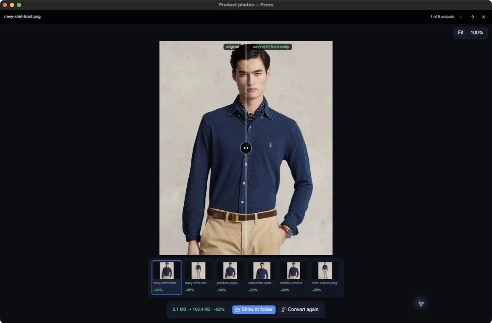
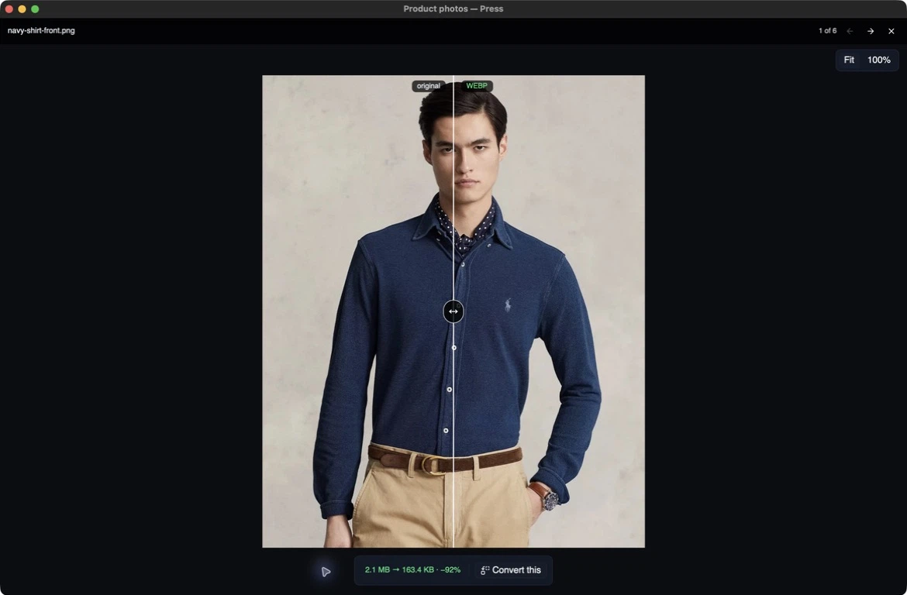

# Press

Audit and optimise a folder of images locally.

The conversion tools on [imageguide.dev](https://www.imageguide.dev/?utm_source=github&utm_medium=readme&utm_campaign=press) post your files
to a worker to do the work. That is fine for one screenshot and wrong for a client
shoot. This does the same job on your computer: auditing, comparing, and converting
do not upload files, and the folder size is bounded by the disk rather than by a
browser tab. Files leave the machine only when you explicitly use a Sirv upload or
run a Studio API tool.



Press is the desktop companion to the site and the
[Chrome extension](https://chromewebstore.google.com/detail/hinifcidioledficgenmdncpkifnngap).
The extension audits the images on a page and stops there, because a browser cannot
rewrite your files. This one can.

## Install

On macOS, install the signed app with Homebrew:

```bash
brew install --cask IgorVaryvoda/press/press
```

On Ubuntu 24.04 x86-64, follow the fingerprint-checked setup for the
[signed Press APT repository](https://github.com/IgorVaryvoda/press-packages#ubuntu-2404-x86-64),
then install or update with `sudo apt install press`.

On any other x86-64 Linux, one command installs the AppImage, its menu entry, and
its icon under `~/.local`:

```bash
curl -fsSL https://raw.githubusercontent.com/IgorVaryvoda/press/main/scripts/install.sh | sh
```

It checks the download against the release's `SHA256SUMS` and installs nothing on a
mismatch. Read it first if you prefer: [`scripts/install.sh`](scripts/install.sh).
Remove Press by deleting `~/.local/bin/press`,
`~/.local/share/applications/press.desktop`, and
`~/.local/share/icons/hicolor/512x512/apps/press.png`.

Or download the current installer from [GitHub Releases](https://github.com/IgorVaryvoda/press/releases/latest):

- Linux: `.deb` for Ubuntu 24.04 x86-64, or `.AppImage`
- macOS: `.dmg` for Apple Silicon or Intel
- Windows: `.exe` installer

A hand-downloaded AppImage does not become executable automatically. From its
folder, run `chmod +x press_*.AppImage`, then `./press_*.AppImage`. In Files, the
equivalent is **Properties → Permissions → Allow executing file as program**. The
install script above and the `.deb` both avoid that step.

AppImage, macOS, and Windows builds check that release feed in the background at
launch. An available update is downloaded, signature-checked, and installed before
Press relaunches itself. Native Linux packages update through their package manager.
Run `press update` to check and install one immediately. Source and package-manager
builds do not update themselves.

## Status

Audit, thumbnails, and WebP, AVIF, and JPEG XL conversion all work.

```bash
press                                         # empty state: pick or drop
press ~/path/to/folder                        # audit, in a window
press ~/photo.jpg                             # straight into the comparison
press audit ~/path/to/folder                  # read-only terminal audit
press audit ~/path/to/folder --json           # stable, agent-friendly report
press convert ~/path/to/folder                # convert to WebP, no window
press convert ~/path/to/folder --format avif --max-edge 1600 --quality 60
press convert ~/path/to/folder --format jxl --lossless
press update                                    # install the latest signed release
```

`press --help` is the complete command reference. `audit` never writes. `convert`
writes mirrored output under `optimized/`; the older `PATH --convert --avif` form
remains compatible. With `--json`, stdout contains one document with
`schema_version: 1`, exact byte counts, per-file findings or conversion outcomes,
and named failures. Diagnostics stay on stderr. Exit `0` means complete success,
`1` means a partial audit or conversion, and `2` means an invalid invocation.

The repo includes an Agent Skill at `.agents/skills/press-cli/SKILL.md`, discovered
automatically by Codex when it runs here. Installed builds also carry the same text:
`press skill` prints it for use by agents in another workspace.

Launched with no path it opens on an empty state: **Open folder…**, **Open images…**,
or drop one folder or any number of images onto the window. The compact source menu
stays in the toolbar afterwards, so you can change source without restarting.
Picking a new one drops every thumbnail and result belonging to the old one, because
a stale saving next to a new file is a lie.

The window reads the current folder only, without scanning subfolders. Breadcrumbs,
search, and the folder tree make moving between folders quick. Terminal `audit` and
`convert` commands still walk subfolders. Images list heaviest first, because that is
where the work is.

| Column | Meaning |
|---|---|
| Thumbnail | Decoded off the main thread, only for rows the viewport asked for |
| Format | The real format, read from the file's magic bytes, not its extension |
| Size | Pixel dimensions |
| File size | Bytes on disk |
| Bytes per pixel | Bytes on disk per output pixel — off by default, shown as `B/px` |

Columns are chosen from the icon at the right end of the header, and the choice is
remembered.

**Format is read from the content.** That column disagreeing with the file extension
is a finding, not a display bug. The first folder this was pointed at —
`imageguide/public` — held 169 files named `.webp`, and 59 of them were PNG.

`B/px` is the quick read on whether a file is carrying weight it does not need. A
photographic JPEG sits near 0.2. A screenshot saved as PNG can be ten times that. It
is the sharpest number here and the least legible one, so it starts switched off and
a file carrying too much says `heavy` in its own row instead. That word needs a file
worth converting behind it: a 44-byte sliver has an enormous ratio and nothing to
give back, so the finding ignores anything under 32 KB or 64x64 px.

**Camera raw is counted, not listed.** `.nef`, `.cr2`, `.arw` and friends are TIFF
containers, so a header read returns the embedded preview — a 6000x4000 NEF reports
as a 160x120 TIFF and every derived number becomes a lie. They are also not web
delivery candidates. The header says how many were skipped rather than quietly
shortening the total.

On macOS, nested packages such as Photos libraries and application bundles are
counted and skipped for the same reason: their internal assets are not web-delivery
images. Pointing Press directly at a package still scans it.

The list is virtualised, and a row's thumbnail is decoded only once it has been on
screen. A folder of 6,000 images does not decode 6,000 files.

Reading headers only is deliberate. Decoding a 6000px JPEG to learn that it is 6000px
wide costs a hundred times what reading its header costs, and a shoot folder holds
thousands of them.

## Sirv Studio API

**Studio** runs five image-producing Studio tools directly from Press: Image to
Image, Background Removal, Background Replace, Image Upscale 2×, and Product
Lifestyle. The prompt field appears only for tools that need one.

Choose **AI operations** while previewing an image or a completed local result, then
create a key in [Studio API settings](https://www.sirv.studio/settings/api?utm_source=github&utm_medium=readme&utm_campaign=press-studio), paste it into the rail, and run the tool. Press verifies and
saves the key owner-only on Unix. It uploads accepted images unchanged. If Studio
does not accept the container, Press prepares an in-memory lossless WebP copy. If
meeting Studio's 20 MB limit needs lossy compression or smaller dimensions, Press
names the proposed size and asks once before uploading. The source is never changed
and the temporary upload copy is never kept as output.

Press calls the authenticated REST endpoint, downloads the result, and opens the
real file beside the original. **Keep** retains it in the output folder; **Discard**
removes it. No Sirv folder pairing or browser handoff is involved.

A normal audit, comparison, or conversion makes no Studio request. Only pressing
the Studio run button uploads an image.

## Optional Sirv sync

Open the Sirv folder browser, choose a remote folder, and pair it with the current
local folder. The audit then stays visibly paired, with filters for files that are
local-only, different, or Sirv-only. **Push** uploads all missing local originals.
**Pull** downloads all missing remote files. Replacing different files requires a
second confirming click. Transfer progress names the current file and retains named
failures; **Stop** prevents the next file from starting. Refresh, change-folder, and
unpair controls stay in the audit instead of hiding inside the folder browser. Like
the local audit, pairing compares the current folder only, not its subfolders.

A completed conversion can publish its outputs to `optimized/` in the paired Sirv
folder and copy responsive image markup. Press also detects numbered image sequences:
complete, consistently sized sets of 8–1000 frames can be published to
`press-spins/`, where Sirv creates the `.spin` file, then copied as a Sirv JS v3
embed. Incomplete or inconsistent sets are named instead of uploaded.

The **preflight** finding applies the file checks Press can prove without decoding:
1400×1400 pixels, no more than 250 KB, and a truthful extension. Background colour
still needs a visual review. **Copy audit** creates a shareable Markdown summary with
the findings, conversion result, heaviest files, and Sirv/Sirv Studio next steps.

The comparison has two local actions that never upload the source:
**Remove background** uses BiRefNet Lite and **Upscale 4×** uses tiled Real-ESRGAN.
Packaged macOS builds include the pinned vision.cpp runtime. Linux x64 downloads a
checksum-verified copy on first use. Both download only the selected model (up to
104 MB total for background removal or 49 MB for upscaling). A finished model run
opens its result for you to **Keep** or **Discard**. Results are lossless PNGs in the
output folder; an existing result is never replaced. Other builds can
point `PRESS_VISION_CLI` at a local vision.cpp build.

Sirv credentials stay in the platform config directory. The credentials
file is written owner-only on Unix systems. Changing credentials or opening another
local folder retires the old remote listing and pairing. No Sirv request happens as
part of a normal audit, comparison, or conversion.

## Converting

The bar along the foot of the window holds the local verbs: **Convert** and the two
local models. Choosing one opens a rail on the right with that operation's own
settings and the button that commits it — for Convert, the
presets, format, quality and size limit, with the projected saving above the button.
Hosted Studio operations appear in the preview where one exact image or completed
local result supplies their context.
`press convert` does the same work without a window.

Files are written to `optimized/` inside the folder, mirroring its subfolder layout.
**Change** in the rail picks a different destination — a staging folder, a share, a
build tree — and the choice is remembered and follows you to the next folder. Sources
are never touched either way, and the output folder is excluded from later scans so a
second run does not offer to convert its own output.

A finished run opens on what it produced: each output beside the file it came from,
read off disk rather than encoded again for the preview, with a strip of every file
the run wrote and what each one saved.



WebP encodes up to eight files at once and AVIF encodes two. JPEG XL encodes one file
at a time because jixel uses the machine's cores inside each encode. Each in-flight
file holds a fully decoded image, so those limits bound memory as much as CPU.

**WebP with real transparency goes lossless** whatever quality you asked for.
libwebp's lossy path mangles alpha in ways that ruin cut-outs. AVIF and JPEG XL keep
alpha on their normal paths. An image with an alpha channel that is entirely opaque
is treated as opaque, because that is just an RGB image paying for a fourth channel.

A file that grew is reported as grown rather than hidden. Re-encoding an
already-optimal JPEG usually costs bytes, and that is worth seeing.

### Size first

Most of the weight in a web image is its dimensions, not its format. Re-encoding a
6400px photo as AVIF still hands back a 6400px photo. The **full / 2400px / 1600px /
1000px** buttons cap the longest edge before encoding, and that single setting beats
every format change:

| Same twelve files, q80 | Result |
|---|---|
| WebP, full size | 76.0 MB → 4.6 MB (94%) |
| AVIF, full size | 76.0 MB → 4.1 MB (95%) |
| AVIF, 1600px | 76.0 MB → **1.1 MB (98%)** |

Downscaling is Lanczos3, not the fast filter used for thumbnails — this one gets
shipped, and a soft downscale wastes the bytes it saves. It never scales up: an 800px
source asked to fit 2000px is already inside the budget.

When a size budget is set, the comparison downscales the *original* side too. Holding
a 6400px source against a 1600px export would measure the resize, not the
compression, and the resize is not the part you need to eyeball.

### Two views

**Grid** switches the list for a gallery of tiles, virtualised the same way — a folder
of 5,700 images decodes only the tiles on screen. `--grid` opens straight into it.

### Before you convert

The toolbar carries a live projection: **≈ 3.1 MB · −96% (from 4)**. Four files are
encoded in memory, spread across the list rather than taken from the top, and the
ratio is applied to the whole job. It re-runs when the format, quality, size or
filter changes, after a short pause so dragging the slider does not start a run per
pixel.

It is a sample, and it says so — on the twelve-file folder above it projected 3.1 MB
against an actual 4.6 MB. Right about the order of the saving, not a promise about
the byte.

### Around the list

Quality is a slider from 1 to 100, with a separate lossless toggle. The box at the
top filters by filename, and narrowing the list narrows what Convert will touch —
converting files you cannot see would be a nasty surprise. Column headers sort. Clicking the active one reverses it; numeric columns open
largest-first and text columns A to Z. Ties fall back to the filename, so equal values
never reshuffle themselves between sorts.

The list takes the keyboard too: arrows and Page Up/Down move, Home and End jump,
Space ticks the row, Enter opens the comparison.

In the comparison, **Escape** closes and the **arrow keys** step to the next image,
which keeps the current format, quality, and size settings — that is the fast way to
sweep a folder for anything the encoder mangles.

The window title follows the folder, a progress bar runs during conversion, and the
tick box in the header row selects or clears everything. Window size and last folder
are remembered between launches. **Show output** appears once a run has written
something.

Failures are named, not counted. Files that will not decode are reported at the top
of the window, and so are the ones a conversion could not read or write — with the
first few filenames, because "3 failed" is not a report.

### Choosing what to convert

Tick rows to convert only those. With nothing ticked, Convert stays disabled; this
keeps estimates and writes limited to files you explicitly selected. On a large
folder you usually want the heaviest files, which are already at the top.

### WebP, AVIF, or JPEG XL

64 size-stratified files from a real photo library, at q80 on a 16-thread machine:

| | Result | Wall clock |
|---|---|---|
| WebP | 134.1 MB → 5.4 MB (96%) | 0.67 s |
| AVIF, former rav1e encoder | 134.1 MB → 4.0 MB (97%) | 21.50 s |
| AVIF, current libaom encoder | 134.1 MB → **3.6 MB** (97%) | **9.07 s** |

The current path is 58% faster and 9% smaller than the former rav1e path at matched
visual quality. It uses the system libavif and libaom libraries directly, with libyuv
acceleration where packaged, so there is no subprocess per image.

JPEG XL is available from the same format dropdown and from `--jxl`. Its jixel
encoder and jxl-oxide decoder are both written in Rust. It supports both lossy
quality levels and true lossless output. Press audits `.jxl` inputs by their contents,
makes thumbnails and comparisons from them, and refuses to flatten an animated JPEG
XL into a still during conversion.

AVIF has no lossless option here. Lossless AVIF is routinely larger than the other
lossless options and much slower to produce, so the UI hides that switch for AVIF.

AVIF carries alpha in its own plane, so unlike WebP it needs no transparency special
case. A test encodes a half-transparent image and decodes it back, because a
regression there would silently flatten every cut-out.

## Comparing

Double-click any row, press **Enter**, or pass a single file to open the original
against the selected format at the current quality. The encode happens in memory —
nothing is written, because the point is to decide whether the trade is acceptable
*before* committing to it.



**The view opens fitted.** Press **100%** to inspect native pixels, or scroll to pick
another zoom level. The original and result stay registered at every scale.

Move the pointer to sweep the divider across. **Hold the left button and drag to
pan** — both sides move together, so they never fall out of register.

At q40 on a 12 MB photo the sky goes from grainy to smooth and the file goes to
262 KB. Whether that is a good trade is a judgement, which is why this shows you
rather than tells you.

The bar carries the same verbs as the audit, acting on the image in front of you:
convert it, run either local model on it, or run it through Studio. Arrows step through
the folder without leaving the view.

## Build

```bash
cargo build --release   # fetches the pinned Rust toolchain on first run
cargo test
```

Needs `dav1d` to decode AVIF and libavif with libaom to encode it. JPEG XL encoding
and decoding are Rust dependencies. Linux packages also provide libyuv for faster
AVIF pixel conversion:

```bash
sudo pacman -S dav1d libavif aom libyuv                  # Arch and derivatives
sudo apt install libdav1d-dev libavif-dev libaom-dev libyuv-dev
brew install libavif                                     # macOS
```

Nothing in `src/` is platform-specific. Two dependencies are, and `Cargo.toml` splits
them by target: gpui's window backends (`wayland` and `x11` are Linux-only features,
and macOS and Windows pick their own), and `rfd`, whose xdg-portal backend keeps GTK
out of the Linux build while the other platforms use their native dialogs by default.

Release tags build the Linux, macOS, and Windows installers on their native GitHub
Actions runners and sign each auto-update artifact.

The UI is [GPUI](https://www.gpui.rs) with
[gpui-component](https://github.com/longbridge/gpui-component) for the widgets.
Neither has a crates.io release, and gpui-component tracks Zed's default branch with
no revision of its own — pinning one here would hand cargo two different git sources
for gpui and two incompatible copies of every type in it. `Cargo.lock` pins the
actual commits; CI builds `--locked`.

## Licence

MIT. See [LICENSE](LICENSE).

The two screenshots in this README were resized to 1100px and compressed by this
tool — 3.7 MB of PNG to 159 KB of WebP at q88.
